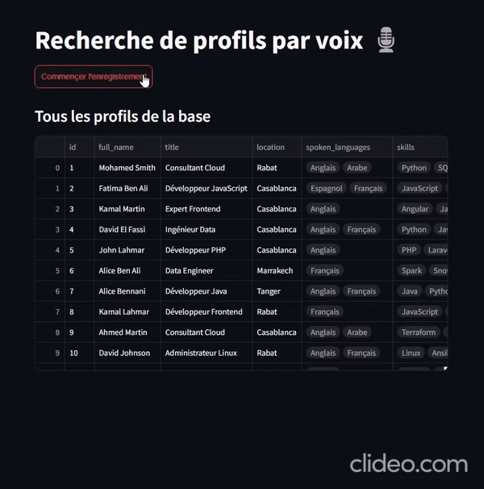

# Profiles Voice Search

**Voice search** allow you to search profiles in a database using your voice. The operation is done in two steps: First, transcript recorded audio, second, parse audio text to extract filters to use to find target profiles in your database.

### Les filtres extractés d'après votre requête:
- Localisation (Ex. Casablanca)
- Niveau d'étude (Ex. Bac +5)
- Expérience (Min et Max) (Ex. Entre 3 et 5 ans)
- Compétences (Ex. Java, Python)
- Langues parlées (Ex. Français, Anglais)

### Demo
<p align="center">
  
</p>

# How to use

- Create a virtual environment:
    - `python3.12 -m venv .venv`
    - `source .venv/bin/activate`
    - `pip install -r requirements.txt`

- Copy the .env.example and fill your environment variables
     - `cp .env.example .env`

- Create a [Deep Infra](https://deepinfra.com/) account it's free with free credits.
- Create a [Lemonfox.ai](https://www.lemonfox.ai/) account it has also one free month trial.
- Copy Deep Infra and Lemonfox keys to your .env file.


**To run the streamlit app run:**
```bash
streamlit run dashboard.py
```

## How it works ?
    .
    ├── data/
        ├── profiles.csv  # Profiles db
    
    ├── docs/                       # Documentation files.
    ├── src/                        # The source directory.
        ├── __init__.py
        ├── search_query.py         # Search query definition.
        ├── pandas_search.py        # Search over a dataframe of profiles based the search query.
        ├── transcribe.py           # Transcript audio query.
        ├── parser.py               # Extract search filters from transcribed audio query.

    ├── notebooks/                  # Interactive code, useful for try and learn.
    ├── dashboard.py                # Streamlit demo.
    ├── config.py
    ├── .env.example                # Environment variables to feed.
    ├── .gitignore
    ├── LICENSE                     # MIT License.
    ├── README.md                   # Where to start.
    └── requirements.txt            # The dependencies.


The process is the following on the dashboard:
- Record your search query
- Correct the transcription if there are any errors in it.
- Parse search filters and show the filtered profiles.